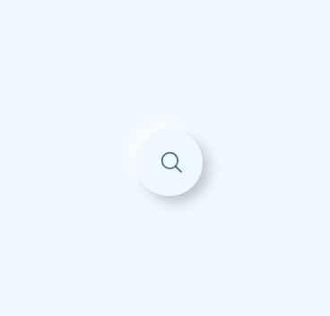
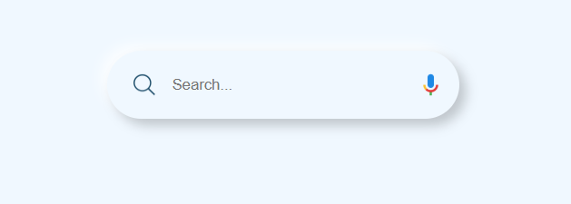

# Animated Search Bar

## Overview
This project is an animated search bar with a smooth toggle effect, designed to enhance user experience on web applications. It features a clean, modern design with responsive animations, making it ideal for search functionalities in websites or apps.

## Features
- **Smooth Animations**: The search bar expands and collapses with a 1.5-second transition effect.
- **Interactive Design**: Click the search or microphone icon to toggle between active and inactive states, adjusting the input field and microphone icon visibility.
- **Responsive Layout**: Centered design with flexible width, suitable for various screen sizes.
- **Minimalist UI**: Styled with a subtle shadow effect and a calming `aliceblue` background.

## Tech Stack
- **HTML5**: For semantic structure.
- **CSS3**: For styling and animations (transitions, shadows, flexbox).
- **JavaScript**: For toggling the search bar's active state dynamically.

## Installation
1. Clone the repository:
   ```bash
   git clone https://github.com/AliDevHub/animated-search-bar.git


## How It Works
1. The search bar starts in an expanded state with a search icon, input field, and microphone icon.
2. Clicking the search icon or microphone icon toggles the active class, collapsing the bar to a compact circular shape (50px wide).
3. The input field and microphone icon smoothly disappear with a transition effect when collapsed.

## Contact
Feel free to reach out for collaboration or feedback: aliraza972003@gmail.com

#### Notes on the README:
- **Live Demo**: I’ve included a placeholder GitHub Pages URL (`https://AliDevHub.github.io/animated-search-bar/`). You’ll need to enable GitHub Pages to make this link work (see Step 4 below).
<a href="https://AliDevHub.github.io/animated-search-bar/">Live Demo</a>
- **Screenshot**: The README references a screenshot (`assets/assets/image.png` and `assets/image-1.png`). If you haven’t added a screenshot yet, 

## ## Screenshots



take one of your search bar, save it in an `assets` folder, and update the repository (I’ll guide you on this if needed).
- **Contact**: Replace `aliraza972003@gmail.com` with your actual email address.

